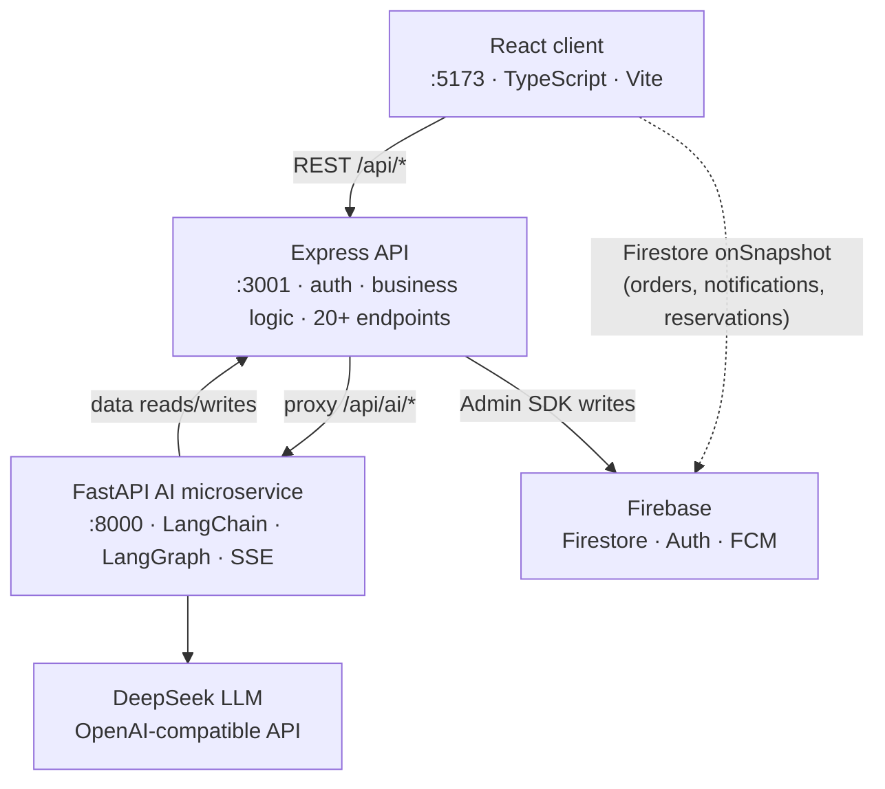

# OrderUp — Restaurant Ordering System

A full-stack restaurant ordering platform with a conversational AI assistant. Customers browse the menu, place orders as guests or registered users, and chat with an AI to book tables, check order status, or ask about the menu. Admins manage live orders, menu items, and reservations through a protected dashboard.

> **Active development.** Core ordering flow, auth, real-time updates, and AI assistant are functional. Some admin features are still being built out.

---

## Features

- **Guest + registered ordering** — anonymous checkout with Firebase silent auth; registered accounts for order history
- **Live order queue** — Firestore `onSnapshot` delivers real-time order and notification updates without polling
- **AI ordering assistant** — LangChain agent with per-session memory, streamed token-by-token via SSE; books tables, looks up orders, answers menu questions
- **Smart table booking** — when a slot is taken, the agent automatically probes ±30/60/90/120-minute alternatives before returning a 409
- **Three-tier auth** — anonymous guest, registered customer, and admin — secured with Firebase custom claims + Firestore Security Rules + Express middleware
- **Admin dashboard** — live order management, menu CRUD, table and reservation control

---

## Architecture

Three services run simultaneously. The browser never talks to FastAPI directly — all traffic routes through Express.



**Key decisions:**
- Express is the **sole** browser-facing backend — the browser never calls FastAPI directly
- Real-time reads use Firestore `onSnapshot` from the client — no polling through Express
- Writes with side effects (FCM push, notification documents) go through Express for atomicity
- Firestore Security Rules are the **primary** access layer; Express middleware is defense-in-depth
- FastAPI owns no database — it calls back to Express for all data reads and writes

---

## Tech Stack

| Layer | Technology |
|---|---|
| Frontend | React 18, TypeScript 5, Vite 5 |
| Routing | React Router v6 |
| Data fetching | TanStack React Query v5 + Firestore `onSnapshot` |
| Styling | Tailwind CSS v3 |
| Backend | Node.js, Express 4, CommonJS |
| Validation | Zod |
| Logging | Winston + Morgan |
| Rate limiting | express-rate-limit |
| Auth / DB / Push | Firebase (Authentication, Firestore, Cloud Messaging) |
| AI microservice | Python, FastAPI, Pydantic |
| Agent framework | LangChain + LangGraph `MemorySaver` |
| LLM | DeepSeek `deepseek-chat` (OpenAI-compatible API) |
| SSE streaming | sse-starlette (FastAPI → Express → browser) |
| Service HTTP | httpx (FastAPI → Express) |
| Testing | Jest + Supertest (server) · pytest (AI agent) |

---

## Project Structure

```
ordering-system/
├── client/                        # React 18 + TypeScript (Vite, :5173)
│   └── src/
│       ├── types/index.ts         # shared domain types
│       ├── services/              # firebase.ts, api.ts, chatApi.ts
│       ├── contexts/              # AuthContext, CartContext, NotificationContext
│       ├── hooks/                 # useOrders, useMenu, useReservations, useChat
│       ├── components/            # NavBar, CartDrawer, MenuCard, ChatPanel, ...
│       └── pages/                 # one file per route
│
├── server/                        # Node.js + Express (CommonJS, :3001)
│   └── src/
│       ├── routes/                # menu, orders, auth, notifications, reservations, tables, ai, logs
│       ├── services/              # orderService, reservationService, notificationService, fcm
│       ├── middleware/            # verifyToken, requireRole, errorHandler
│       └── utils/                 # logger (Winston), AppError
│
├── ai-agent/backend/              # Python + FastAPI (:8000)
│   ├── main.py                    # /api/chat, /api/session/:id, /api/health
│   ├── src/
│   │   ├── agent.py               # LangChain agent + LangGraph MemorySaver
│   │   ├── data.py                # load_menu() — fetches from Express
│   │   └── prompts.py             # loads system prompt
│   ├── tools/                     # menu, specials, reserve_table, order_status, calculator
│   └── prompts/restaurant.md      # AI persona + opening hours
│
└── docs/                          # api-contract.md, technical-design.md, requirements.md
```

---

## Getting Started

### Prerequisites

- Node.js 18+
- Python 3.10+
- A Firebase project with **Firestore**, **Authentication** (Email/Password + Google + Anonymous), and **Cloud Messaging** enabled
- A [DeepSeek API key](https://platform.deepseek.com)

### 1. Clone and set up environment files

```bash
git clone https://github.com/congcong919/ordering-system.git
cd ordering-system
```

Create the three `.env` files below before starting any service.

### 2. Firebase setup

1. Go to [Firebase Console](https://console.firebase.google.com) → your project → Project Settings → Service Accounts
2. Click **Generate new private key** — this gives you a JSON file
3. Copy values from that JSON into `server/.env`:
   - `FIREBASE_PROJECT_ID` → `project_id`
   - `FIREBASE_CLIENT_EMAIL` → `client_email`
   - `FIREBASE_PRIVATE_KEY` → `private_key` (keep the `
` characters as-is)
4. Go to Project Settings → General → Your apps → copy the Firebase config values into `client/.env`

### 3. Start the services

All three must run simultaneously. Open three terminals:

**Terminal 1 — Express API**
```bash
cd server
npm install
npm run dev          # runs on :3001
```

**Terminal 2 — AI Agent**
```bash
cd ai-agent/backend
pip install -r requirements.txt
uvicorn main:app --reload --port 8000   # runs on :8000
```

> Express must be running before FastAPI — the agent tools call it at startup.

**Terminal 3 — React client**
```bash
cd client
npm install
npm run dev          # runs on :5173, open http://localhost:5173
```

### 4. Seed data

The app needs at least some menu items and a table config in Firestore to function. Add them manually via Firebase Console → Firestore, or run the seed script if one is available in `docs/`.

### 5. Grant admin access

1. Sign in with Google via the app
2. Copy your Firebase UID from the browser console (or Firebase Console → Authentication)
3. Run:
```bash
curl -X POST http://localhost:3001/api/auth/set-admin \
  -H "Content-Type: application/json" \
  -d '{"uid": "YOUR_UID", "secret": "YOUR_SETUP_SECRET"}'
```
4. Sign out and back in — you now have admin access

---

## Environment Variables

### `server/.env`
```
PORT=3001
FIREBASE_PROJECT_ID=         # from Firebase service account JSON
FIREBASE_CLIENT_EMAIL=       # from Firebase service account JSON
FIREBASE_PRIVATE_KEY=        # from Firebase service account JSON — keep literal 

SETUP_SECRET=                # any secret string, used to grant admin role
AI_AGENT_URL=http://localhost:8000
```

### `client/.env`
```
VITE_FIREBASE_API_KEY=             # Firebase Console → Project Settings → Your apps
VITE_FIREBASE_AUTH_DOMAIN=
VITE_FIREBASE_PROJECT_ID=
VITE_FIREBASE_MESSAGING_SENDER_ID=
VITE_FIREBASE_APP_ID=
VITE_FIREBASE_VAPID_KEY=           # optional — enables browser push notifications
VITE_API_BASE_URL=                 # leave empty in dev (Vite proxy handles it)
```

### `ai-agent/backend/.env`
```
DEEPSEEK_API_KEY=            # from https://platform.deepseek.com
ORDERING_API_URL=http://localhost:3001
ALLOWED_ORIGINS=http://localhost:3001
```

---

## Auth Model

| User | Sign-in | Role |
|---|---|---|
| Guest | Firebase Anonymous Auth (silent on checkout) | None |
| Customer | Email / Password | `customer` |
| Admin | Google Sign-In + custom claim | `admin` |

**Granting admin:** sign in → grab Firebase UID → `POST /api/auth/set-admin` with UID + `SETUP_SECRET` → sign out and back in.

---

## AI Assistant

The OrderUp Assistant is a LangChain agent (singleton) backed by LangGraph `MemorySaver` for per-session conversation history. Sessions are keyed by UUID; history is cleared on FastAPI restart by design.

The agent receives the user's Firebase token so it can make authenticated requests. All traffic routes through Express — FastAPI is never exposed to the browser.

### Tools

| Tool | What it does |
|---|---|
| `menu_tool` | Browse menu items, filter by category |
| `specials_tool` | Return items flagged `isSpecial: true` |
| `reserve_table_tool` | Book a table; probes ±30/60/90/120 min if slot is taken |
| `order_status_tool` | Look up live order status (requires Firebase token) |
| `calculator_tool` | Safe math via `asteval` — never `eval()` |

---

## API Routes

| Method | Path | Auth | Purpose |
|---|---|---|---|
| GET | `/api/menu` | Public | List menu items |
| POST | `/api/menu` | Admin | Create item |
| PUT | `/api/menu/:id` | Admin | Update item |
| DELETE | `/api/menu/:id` | Admin | Delete item |
| POST | `/api/orders` | Guest / Customer | Place order |
| GET | `/api/orders/:id` | Owner or Admin | Get order |
| PATCH | `/api/orders/:id/status` | Admin | Advance status |
| GET | `/api/notifications` | Customer | User notifications |
| PATCH | `/api/notifications/:id/read` | Customer | Mark read |
| POST | `/api/auth/set-admin` | `SETUP_SECRET` | Grant admin role |
| POST | `/api/ai/chat` | — | Streaming proxy to FastAPI |
| DELETE | `/api/ai/session/:id` | — | Clear chat session |
| GET | `/api/reservations` | Admin | All reservations |
| POST | `/api/reservations` | Public | Book table |
| PATCH | `/api/reservations/:id` | Admin | Reschedule |
| PATCH | `/api/reservations/:id/status` | Admin | Lifecycle update |
| GET | `/api/reservations/availability` | Public | Check slot |
| GET | `/api/tables` | Public | Table config |
| POST | `/api/tables` | Admin | Add table |
| PUT | `/api/tables/:number` | Admin | Update table |
| DELETE | `/api/tables/:number` | Admin | Remove table |

**Order status flow:** `pending → confirmed → preparing → ready → completed` (or `cancelled`)

**Reservation status flow:** `confirmed → seated → completed` (or `cancelled`)

---

## Firestore Collections

| Collection | Created by | Key fields |
|---|---|---|
| `menus` | Manual seed | `name`, `price`, `category`, `available`, `isSpecial?` |
| `orders` | `POST /api/orders` | `customerId`, `items[]`, `total`, `status` |
| `users` | Client | `role`, `fcmToken` |
| `notifications` | `notificationService` | `recipientId`, `orderId`, `type`, `read` |
| `reservations` | `reservationService` | `date`, `time`, `tableNumber`, `status` |
| `config/tables` | Admin UI | `tables: [{ number, capacity }]` |
| `config/restaurant` | Manual seed | `name`, `address`, `openingHours` |

### Security Rules Summary

| Collection | Read | Write |
|---|---|---|
| `menus` | Anyone | Admin only |
| `orders` | Owner or Admin | Create: owner; Update: Admin only |
| `users` | Own doc; Admin reads all | Own doc only |
| `notifications` | Own doc | Own doc; server (Admin SDK) unrestricted |
| `reservations` | Owner or Admin | Server (Admin SDK) creates; Update: Admin only |
| `config` | Anyone | Admin only |

> Rules live in `server/firestore.rules`. After any change, republish via Firebase Console → Firestore → Rules.

---

## Testing

- **Server:** Jest + Supertest against the real Express app with Firebase Admin SDK mocked. Each service has happy-path and failure-path coverage.
- **AI agent:** 76 pytest tests covering tool units, booking date/time validation, FastAPI integration, startup validation, security (no `eval()`, no file-read tool), and CORS.

```bash
cd server && npm test
cd ai-agent/backend && pytest tests/
```

---

## Roadmap

- [ ] **Production deployment** — Docker Compose backend on EC2, static frontend assets on S3, CloudFront CDN distribution with a restricted Security Group that avoids exposing the backend directly to the public internet
- [ ] **RAG knowledge base** — embed restaurant-specific documents (full menu details, allergen info, chef's notes, seasonal specials) into a vector store and wire it into the AI agent as a retrieval tool, replacing hardcoded prompt context with dynamic, updatable knowledge
- [ ] Analytics dashboard for order trends and peak hours
